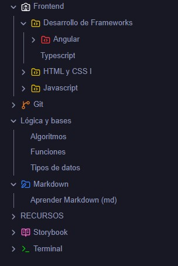

La mayoría de diseñadores que programan se quedan en la superficie. Aprenden suficiente React para construir un componente, suficiente CSS para que se vea bien, y siguen adelante. Eso funciona -hasta que deja de funcionar.

## El problema del conocimiento superficial

Cuando algo se rompe, depuras adivinando. Cuando necesitas tomar una decisión sobre arquitectura, se la dejas a otro. Cuando un desarrollador rechaza una implementación, no puedes distinguir si es una restricción real o una preferencia.

El conocimiento superficial te hace dependiente.

## Ir una capa más profundo

No necesitas convertirte en ingeniero de sistemas. Pero entender _por qué_ tus herramientas funcionan como funcionan cambia cómo las usas.

Por ejemplo:

- Saber cómo el navegador pinta píxeles explica por qué algunas propiedades CSS generan layout shifts y otras no
- Entender cómo los bundlers resuelven módulos explica por qué tus imports funcionan en un proyecto y fallan en otro
- Aprender cómo tu framework de componentes maneja la reactividad explica cuándo las actualizaciones de estado se sentirán instantáneas y cuándo lentas

## El efecto compuesto

Cada vez que aprendes algo sobre tu stack, tomas mejores decisiones. Esas decisiones se acumulan. En seis meses, no solo eres más rápido -estás tomando decisiones completamente diferentes.

El desarrollador que entiende sus herramientas no solo construye features. Construye features que son más fáciles de mantener, más rápidas de renderizar y más simples de extender.

## Por dónde empezar

Elige la herramienta que más usas y lee su documentación. No la guía de inicio rápido -la sección de conceptos. La parte que explica el modelo mental detrás del API.

Luego construye algo pequeño que ponga a prueba ese modelo mental. Rómpelo a propósito. Observa qué pasa. Si algo te interesa, de todo lo que vas aprendiendo, te recomendaría tomar notas. Escribir es una buena forma de aprender también. En mi caso, utilizo Obsidian.

*Algunos temas de mis notas*

Así es como dejas de ser un preso de tus herramientas y empiezas a ser alguien que construye con libertad. Aún no sé todo lo que quiero saber, pero cada día doy un paso adelante. Te animo a aprender un poquito más, cada día.
